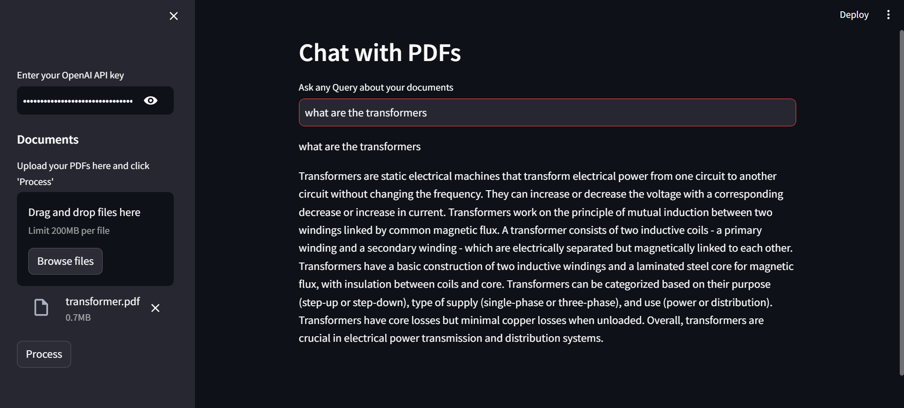

<a href="https://convo-pdf.streamlit.app/">Click Here to Open the App</a>
<h1>Chat with PDFs</h1>

We need to input OpenAI API key for creating vector embeddings

This model takes a pdf uploaded by the user.

Extracts the text from the pdf.

Creates embeddings of the extracted text and stores in a vector database to be used during conversation.

Using a reatrievel system the user query is answered from the text that is present in the pdf

<h2>How it looks..</h2>

